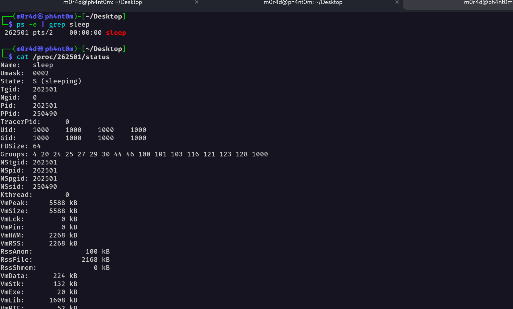
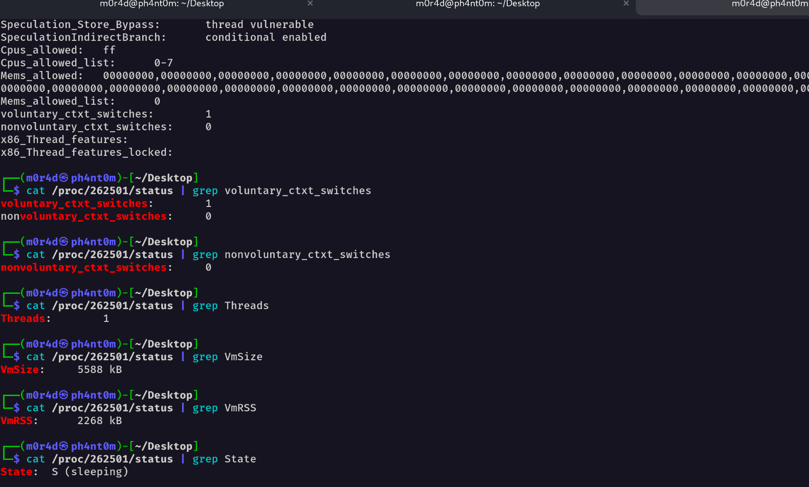

# The solution of questions:

- Stores the process state so the OS can save and restore it during a context switch.

- Process state, program counter, CPU registers, and PPID ... and many info (look at screenshots below )

- Multiple threads allow concurrency but may increase the number of context switches.

- When a process terminates, its PCB is removed and resources are freed.

- Linux/macOS expose process information via tools like `ps`, `top`, and `/proc` while Windows mainly uses Task Manager

# First Looking for the PID

# Then finding the PID info in /proc/ by parsing status file

# Analysing with htop

